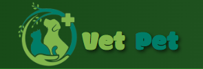
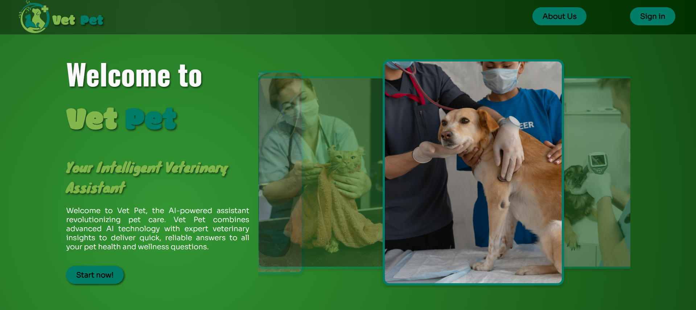

# VetPet Assistant - Student Project

**VetPet** je web aplikacija dizajnirana da olakša istraživanje i pružanje informacija o zdravlju i nezi kućnih ljubimaca. Korisnicima nudi intuitivno iskustvo interakcije putem chata sa virtuelnim asistentom VetPet ChatBot. Ova aplikacija rešava problem potrebe za brzim, tačnim i stručnim odgovorima na pitanja vezana za zdravlje i dobrobit kućnih ljubimaca. Korisnici mogu dobiti informacije o ishrani, zdravlju, prosečnom životnom veku, staništu i ponašanju različitih vrsta kućnih ljubimaca na jednom mestu.



Aplikacija koristi Wit.ai tehnologiju za obradu prirodnog jezika, omogućavajući VetPet ChatBotu da prepozna korisničke upite i pruži personalizovane odgovore. Korisnici takođe mogu dobiti zabavne i edukativne činjenice o psima, zahvaljujući integraciji sa Dog API, koji generiše nasumične činjenice o psima. Na ovaj način, VetPet ne samo da pruža korisne informacije, već i poboljšava korisničko iskustvo kroz interaktivnost i zabavu.

Za vizuelni prikaz podataka, aplikacija integriše Unsplash API, omogućavajući prikaz slika vezanih za određene vrste ili rase životinja. Ovo doprinosi boljem razumevanju i vizualizaciji informacija koje korisnici traže.

Administratori aplikacije igraju ključnu ulogu u održavanju sistema. Njihova kontrolna tabla omogućava upravljanje korisnicima, pregled podataka i statistika, uključujući broj interakcija i osnovne informacije o korisnicima. Administratori takođe mogu uređivati podatke korisničkih profila, brisati neadekvatne poruke i pratiti statistiku aplikacije kako bi osigurali kvalitetne usluge.

VetPet Assistant, razvijen na MERN stack-u (MongoDB, Express, React, Node.js) sa MVC arhitekturom, rešava izazov dostupnosti informacija o zdravlju kućnih ljubimaca i omogućava korisnicima brzo i jednostavno dobijanje informacija. Administratori, s druge strane, imaju sveobuhvatan pregled nad podacima aplikacije i interakcijama korisnika, čineći sistem pouzdanim i skalabilnim.


## Instalacija

1. Klonirajte repozitorijum:
   ```bash
   git clone https://github.com/elab-development/internet-tehnologije-2024-projekat-chatbot_projekat_20210234_20200054.git
2. Instalirajte biblioteke:
    ```bash
    npm install
3. Udjite u direktorijum za server:
    ```bash
    cd projekat
    cd server
    npm start
4. Udjite u direktorijum za klijenta:
    ```bash
    cd projekat
    cd server
    npm start
5. Pokrenite aplikaciju u web pregledacu i pokrenite caskanje!





